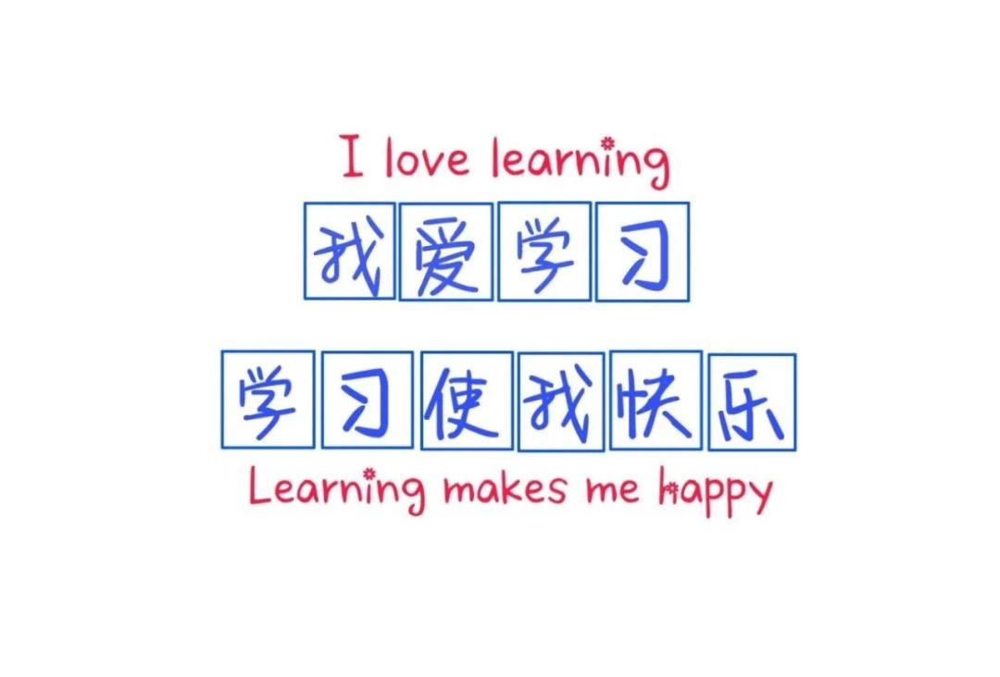

# Python 基础课程 第一讲教案

## 课程基本信息

| 项目         | 内容                     |
|--------------|--------------------------|
| 课程名称     | Python 基础              |
| 授课对象     | 计算机专业大一学生       |
| 授课教师     | [教师姓名]               |
| 课时         | 90 分钟                  |
| 授课日期     | [具体日期]               |
| 教学地点     | [教室/实验室编号]        |

## 教学目标

### 知识目标
- 了解 Python 语言的发展历史与应用领域
- 掌握 Python 的基本语法特点
- 理解解释型语言与编译型语言的区别
- 熟悉 Python 开发环境的搭建与使用

### 能力目标
- 能够安装并配置 Python 运行环境
- 能够使用 IDLE 或 VS Code 编写并运行简单程序
- 能够输出“Hello, World!”并理解其含义

### 情感与态度目标
- 激发学生对编程的兴趣
- 培养严谨的编程习惯和问题解决意识

## 教学重点与难点

### 教学重点
- Python 语言的特点与优势
- 开发环境的安装与配置
- 第一个 Python 程序的编写与运行

### 教学难点
- 环境变量配置（针对 Windows 用户）
- 区分 Python 2 与 Python 3 的差异（简要说明）

## 教学方法
- 讲授法：介绍 Python 背景与基本概念
- 演示法：现场演示环境安装与代码编写
- 实践法：学生动手操作，完成第一个程序
- 问答互动：鼓励学生提问，及时答疑

## 教学准备
- 教师准备：
  - 安装好 Python 3.10+ 的演示电脑
  - 准备 PPT 课件
  - 示例代码文件
- 学生准备：
  - 笔记本电脑（建议提前安装 Python）
  - 笔记本与笔

## 教学过程

### 一、课程导入（10 分钟）

> “编程不是天才的专利，而是每个愿意动手尝试的人的工具。”  
> —— 本课程寄语

- 自我介绍与课程简介
- 为什么学习 Python？
  - 简洁易读，适合初学者
  - 应用广泛：Web 开发、数据分析、人工智能、自动化脚本等
  - 社区活跃，资源丰富

### 二、Python 语言概述（15 分钟）

#### 1. 发展简史
- 1989 年由 Guido van Rossum 创建
- 名字来源于喜剧团体 Monty Python
- Python 2 与 Python 3 的分水岭（2008 年）
- 当前主流版本：Python 3.10+

#### 2. 语言特点
- **解释型语言**：逐行解释执行，无需编译
- **动态类型**：变量无需声明类型
- **缩进敏感**：用缩进代替大括号定义代码块
- **跨平台**：Windows / macOS / Linux 通用

### 三、开发环境搭建（20 分钟）

#### 推荐工具
| 工具        | 说明                             |
|-------------|----------------------------------|
| Python 官方 | https://www.python.org/downloads |
| VS Code     | 轻量级编辑器，支持 Python 插件   |
| IDLE        | Python 自带的简易 IDE            |
| PyCharm     | 功能强大（可选，后续课程推荐）   |

#### 安装步骤（以 Windows 为例）
1. 访问 [python.org](https://www.python.org/downloads)
2. 下载最新版 Python（勾选 **Add to PATH**！）
3. 安装完成后，打开命令提示符（CMD）输入：
   ```bash
   python --version
   ```
4. 若显示版本号（如 `Python 3.12.0`），则安装成功

> 💡 提示：macOS 和 Linux 通常预装 Python，但建议升级至 3.10+

### 四、第一个 Python 程序（20 分钟）

#### 1. 使用 IDLE 编写
- 打开 IDLE → File → New File
- 输入以下代码：
  ```python
  # 第一个 Python 程序
  print("Hello, World!")
  print("欢迎来到 Python 编程世界！")
  ```
- 保存为 `hello.py`，按 F5 运行

#### 2. 代码解析
- `print()`：输出函数
- `#`：注释符号，程序运行时忽略
- 字符串用双引号或单引号包裹

#### 3. 学生实践
- 每位学生独立完成“Hello, World!”程序
- 尝试修改输出内容（如输出自己的姓名）

### 五、课堂小结与答疑（15 分钟）

- 回顾本节课要点：
  - Python 是什么？为什么学？
  - 如何安装和运行？
  - 第一个程序怎么写？
- 常见问题解答：
  - “为什么我的 `python` 命令无效？” → 检查 PATH 配置
  - “缩进错误怎么办？” → 统一使用空格或 Tab（推荐 4 空格）
- 强调：**编程 = 动手 + 思考**

### 六、课后任务（10 分钟）

1. **必做**：
   - 在自己电脑上成功运行 `print("My name is [你的名字]")`
   - 截图提交至课程平台
2. **选做**：
   - 浏览 [Python 官方教程](https://docs.python.org/zh-cn/3/tutorial/)
   - 尝试输出多行文本（使用多个 `print` 或 `\n`）

## 板书设计（PPT 要点）

```
Python 基础 第一讲
├─ 什么是 Python？
├─ 为什么学 Python？
├─ 环境搭建（Python + 编辑器）
├─ 第一个程序：Hello, World!
└─ 动手实践 → 成就感！
```

## 教学反思（课后填写）
- 学生环境配置是否顺利？
- 是否需要增加虚拟机或在线环境（如 Replit）作为备选方案？
- 互动环节是否充分？




| 列1 | 列2 | 列3 |
| --- | --- | --- |
|   |   |   |
|   |   |   |
